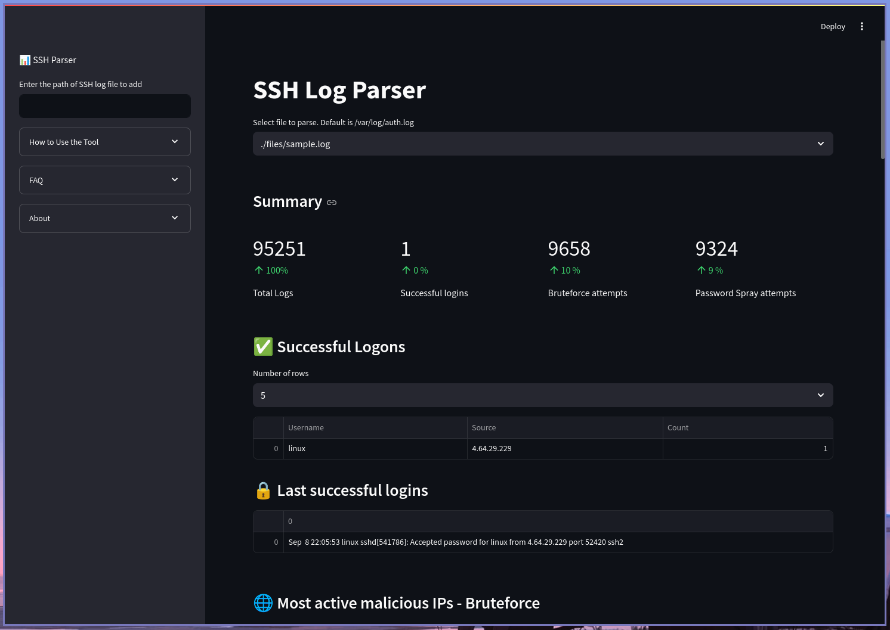
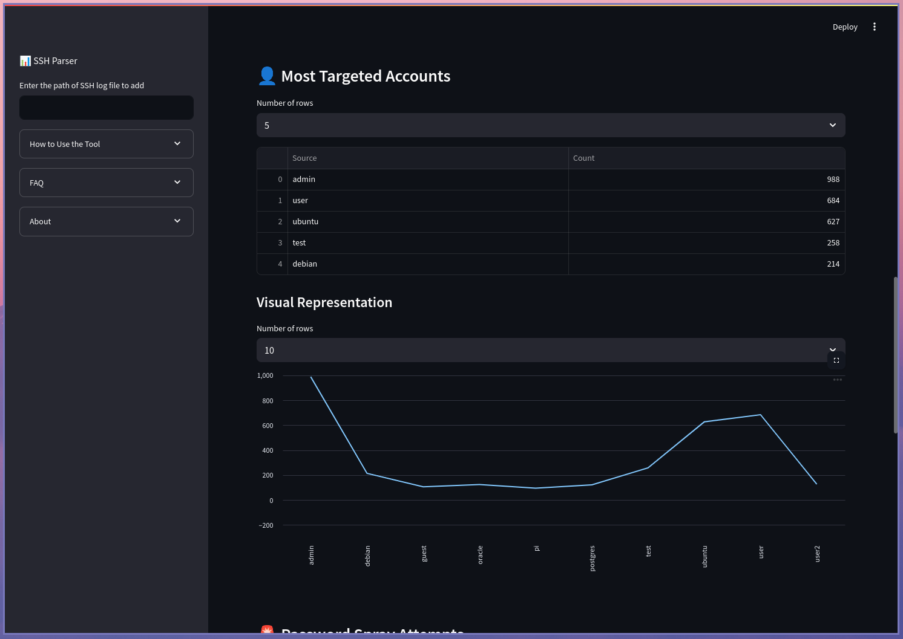
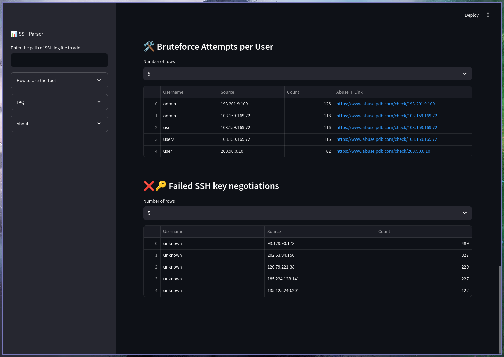

# SSH Parser

**SSH Parser** is a simple streamlit-based web application designed to parse and analyze SSH logs. It provides an intuitive interface for monitoring and auditing SSH activities.

---

## Features

- Parse SSH log files
- Filter logs by IP address
- Monitor successful login attempts
- Identify failed or suspicious login attempts
- Export parsed data for further analysis

---

## Installation

Follow these steps to set up the project locally:

### 1. Clone the Repository

```bash
git clone https://github.com/allannjuguna/SSH-Parser.git
cd ssh-parser
```

### 2. Clone the Repository
```bash
python3 -m venv venv
source venv/bin/activate
```

### 3. Install Dependencies
```bash
pip install -r requirements.txt
```


## Installation
Start the Streamlit app with the following command:

```bash
streamlit run app.py
```


## Screenshots





